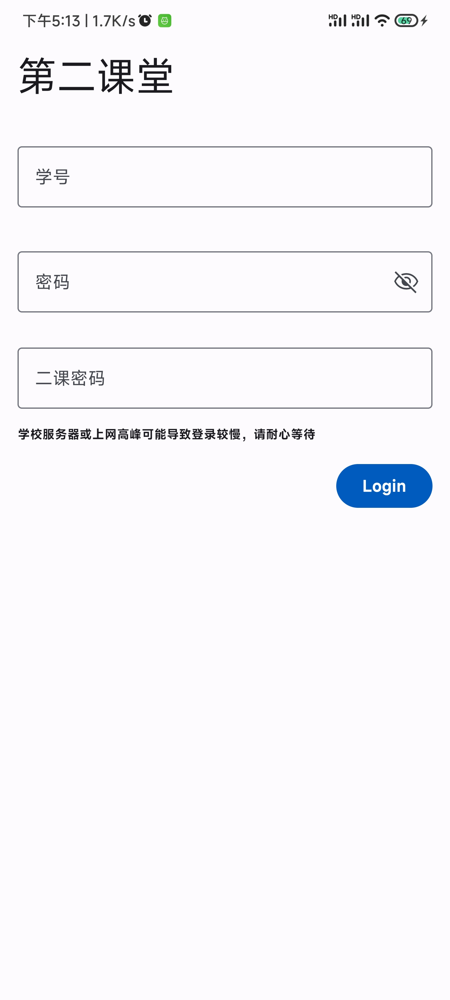
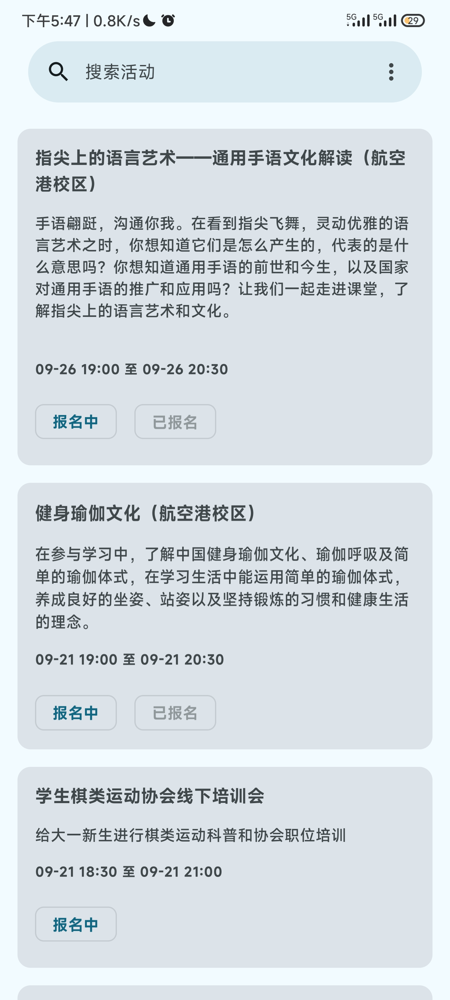
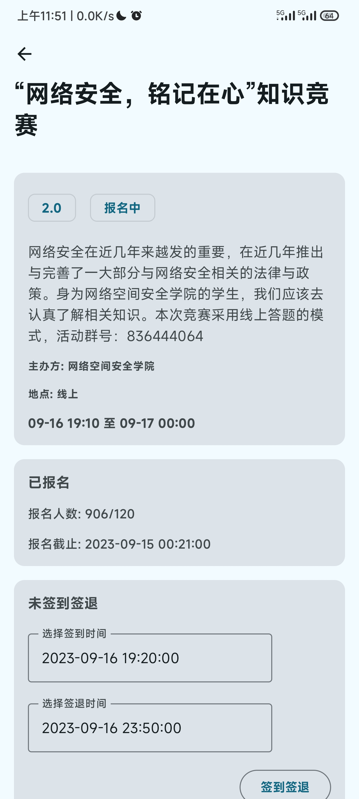
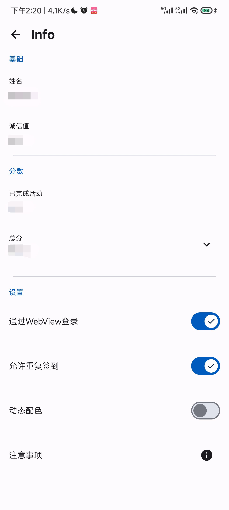

# SecondClass
cuit第二课堂安卓客户端  

***请尽可能在合理时间内进行报名签到***   
***(如只签到进行中的活动)***  
***违规行为导致的后果自负***

## 功能
- 校外网(webvpn)登录
- 对非完结状态的活动**报名**(报名中,待开始,进行中)  
- 任意时间**签到**并可选择签到/签退时间  
- 生成活动的签到签退链接

## 注意事项
- 若默认登录方式失败: 选择`通过网页(WebView)登录`([pr](https://github.com/thriic/SecondClass/pull/4))  
- 网络访问较慢: 选择人少的时间或连接学校wifi  
- 请根据二课审核机制合理选择签到签退时间  

## 使用截图
|  |   |   |  |  |
|---------------------------------|---------------------------------|---------------------------------|----------------------------------|--------------------------------|
